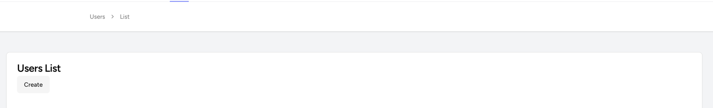
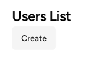
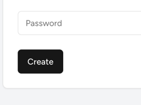
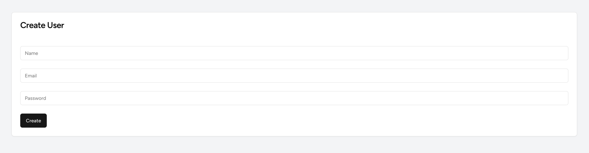
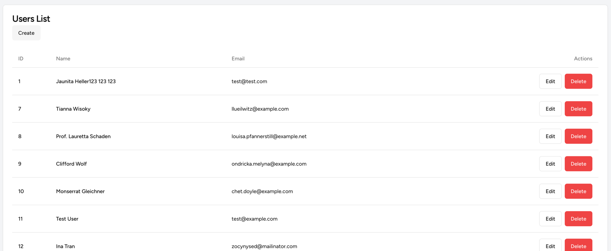
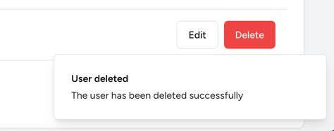
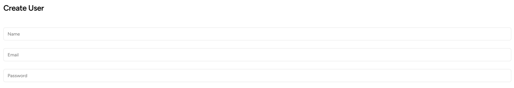

# Readme

Installing shadcn/ui:

```bash
laravel new my-app --typescript --breeze --stack=react --git --no-interaction
npx shadcn@latest init
npx shadcn@latest add
```

Then wait for list to load, press `a` and `enter`. This will create all the necessary files for you.

From there, you can use all components as needed.

---

## List of Used Components:

- BreadCrumbs - https://ui.shadcn.com/docs/components/breadcrumb
- Button - https://ui.shadcn.com/docs/components/button
- Card - https://ui.shadcn.com/docs/components/card
- Table - https://ui.shadcn.com/docs/components/table
- Toast - https://ui.shadcn.com/docs/components/toast
- Input - https://ui.shadcn.com/docs/components/input

All installation commands follow the same pattern:

```bash
npx shadcn@latest add <component>
```

Once installed, they will be copied to the `resources/js/Components/ui` folder.

From there, you can use them as needed by importing them in your components/pages.

---

## Usage Examples

### BreadCrumbs

Installing with npm:

```bash
npx shadcn@latest add breadcrumb
```

**resources/js/Pages/Users/Index.tsx**
```tsx
return <AuthenticatedLayout
    header={
        <Breadcrumb>
            <BreadcrumbList>
                <BreadcrumbItem>
                    <Link href={route('users.index')}>Users</Link>
                </BreadcrumbItem>
                <BreadcrumbSeparator/>
                <BreadcrumbItem>
                    <Link href={route('users.index')}>List</Link>
                </BreadcrumbItem>
            </BreadcrumbList>
        </Breadcrumb>
    }>
```



---

### Button

Installing with npm:

```bash
npx shadcn@latest add button
```

```tsx
<Link className={buttonVariants({variant: "secondary"})}
      href={route('users.create')}>Create</Link>

<Button type={"submit"}>Create</Button>

<Link className={buttonVariants({variant: "outline"})}
      href={route('users.edit', [user.id])}>Edit</Link>

<Button onClick={() => deleteUser(user.id)} type="button"
        className={"ml-2"}
        variant={"destructive"}>Delete</Button>
```






---

### Card

Installing with npm:

```bash
npx shadcn@latest add card
```

**resources/js/Pages/Users/Index.tsx**
```tsx
<Card className={"mx-12"}>
    <CardHeader>
        <CardTitle>Users List</CardTitle>
        <CardDescription>
            <Link className={buttonVariants({variant: "secondary"})}
                  href={route('users.create')}>Create</Link>
        </CardDescription>
    </CardHeader>
    <CardContent>
        <Table>
            <TableHeader>
                <TableRow>
                    <TableHead className="w-[100px]">ID</TableHead>
                    <TableHead>Name</TableHead>
                    <TableHead>Email</TableHead>
                    <TableHead className="text-right">Actions</TableHead>
                </TableRow>
            </TableHeader>
            <TableBody>
                {users.flatMap(
                    (user: User) => {
                        return (<TableRow key={user.id.toString()}>
                            <TableCell className="font-medium">{user.id.toString()}</TableCell>
                            <TableCell className="font-medium">{user.name}</TableCell>
                            <TableCell>{user.email}</TableCell>
                            <TableCell className="text-right">
                                <Link className={buttonVariants({variant: "outline"})}
                                      href={route('users.edit', [user.id])}>Edit</Link>
                                <Button onClick={() => deleteUser(user.id)} type="button"
                                        className={"ml-2"}
                                        variant={"destructive"}>Delete</Button>
                            </TableCell>
                        </TableRow>)
                    })
                }
            </TableBody>
        </Table>
    </CardContent>
</Card>
```



---

### Table

Installing with npm:

```bash
npx shadcn@latest add table
```

**resources/js/Pages/Users/Index.tsx**
```tsx
<Table>
    <TableHeader>
        <TableRow>
            <TableHead className="w-[100px]">ID</TableHead>
            <TableHead>Name</TableHead>
            <TableHead>Email</TableHead>
            <TableHead className="text-right">Actions</TableHead>
        </TableRow>
    </TableHeader>
    <TableBody>
        {users.flatMap(
            (user: User) => {
                return (<TableRow key={user.id.toString()}>
                    <TableCell className="font-medium">{user.id.toString()}</TableCell>
                    <TableCell className="font-medium">{user.name}</TableCell>
                    <TableCell>{user.email}</TableCell>
                    <TableCell className="text-right">
                        <Link className={buttonVariants({variant: "outline"})}
                              href={route('users.edit', [user.id])}>Edit</Link>
                        <Button onClick={() => deleteUser(user.id)} type="button"
                                className={"ml-2"}
                                variant={"destructive"}>Delete</Button>
                    </TableCell>
                </TableRow>)
            })
        }
    </TableBody>
</Table>
```



---

### Toast

Installing with npm:

```bash
npx shadcn@latest add toast
```

**resources/js/Pages/Users/Index.tsx**
```tsx
toast({
    title: "User deleted",
    description: "The user has been deleted successfully",
})
```

And registered in the Layout:

**resources/js/Layouts/AuthenticatedLayout.tsx**
```tsx
<div className="min-h-screen bg-gray-100">
            <Toaster/>
            <nav className="border-b border-gray-100 bg-white">
```



---

### Input

**resources/js/Pages/Users/Create.tsx**
```tsx
<form onSubmit={submit} className="mt-6 space-y-6">
    <Input name={"name"} placeholder={"Name"} value={data.name}
           onChange={(e) => setData('name', e.target.value)}/>
    <Input name={"email"} placeholder={"Email"} value={data.email}
           onChange={(e) => setData('email', e.target.value)}/>
    <Input name={"password"} placeholder={"Password"} value={data.password}
           type={"password"}
           onChange={(e) => setData('password', e.target.value)}/>
    <Button type={"submit"}>Create</Button>
</form>
```



